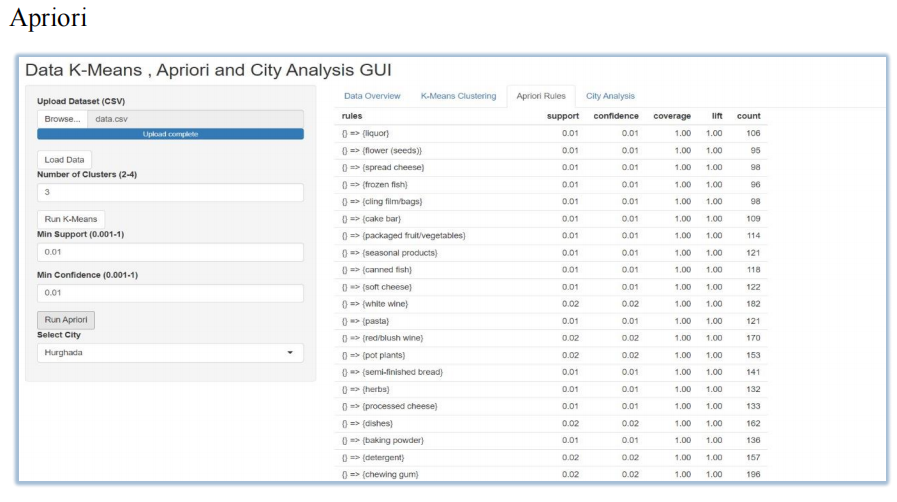
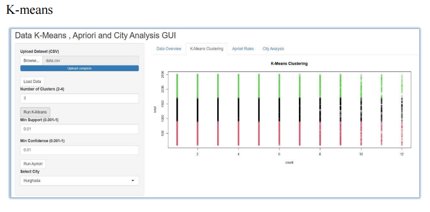
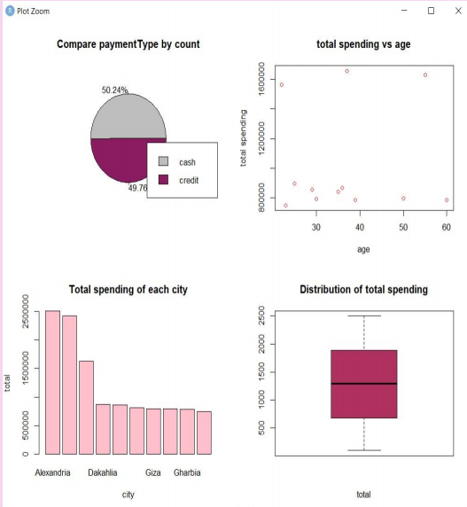

# Grocery Customer Data Analysis and Visualization

This project is a complete Grocery Customer Data Analysis and Visualization System developed using R and Shiny.  
It allows users to clean data, visualize insights, perform K-Means clustering, and generate association rules using Apriori.

## Features
- Data cleaning and preprocessing
- Payment type analysis, spending by age, and city comparison
- K-Means clustering (user-defined clusters)
- Association rule mining (Apriori)
- Interactive GUI using Shiny

## Libraries Used
- dplyr, tidyr, readxl, writexl, openxlsx
- ggplot2
- arules
- shiny

## Usage
1. Open `app.R` in RStudio.
2. Run the Shiny app.
3. Upload your dataset and interact with the dashboard.

## Project Screenshots

### Apriori

### K-Means Clustering

### visualization dashboard

